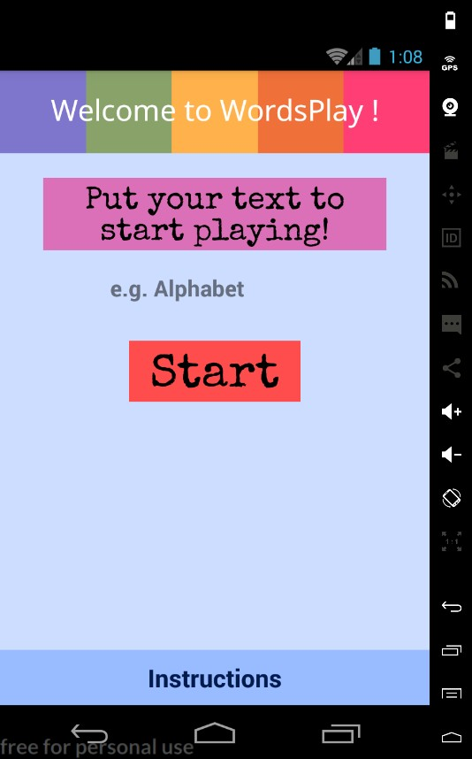
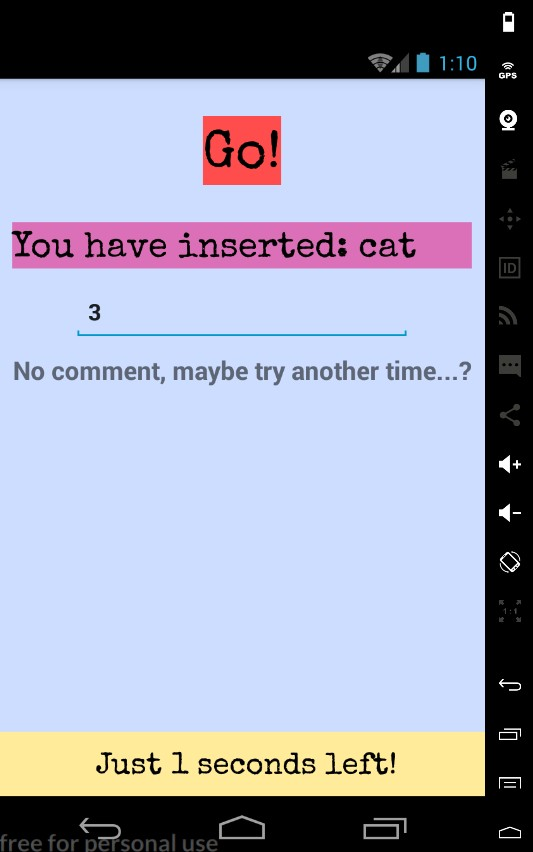

# WordsPlay

## What is this?

An educational game written in React-Native for the Android platform (iOS version is expected in near future).
The idea for game was born on the fly, so whole project is not really serious, especially considering game layout.

## Tech Stack

Tech-stack for application consists of React-Native (of course), react-redux and react-native-router-flux. There is no database plugged into back-end, just playing around with reducers & built-in data persistence.

## How to play?

The application is still in development, however if you are RN developer you can simply clone project & generate and APK on your own. First release is expected to take place around late July.

## Improvements

Not much to do, as fun project (mainly to learn RN concepts), it is just for learning purposes.

## Screenshots

Welcome Screen             |  Game Action Screen
:-------------------------:|:-------------------------:
  |  
